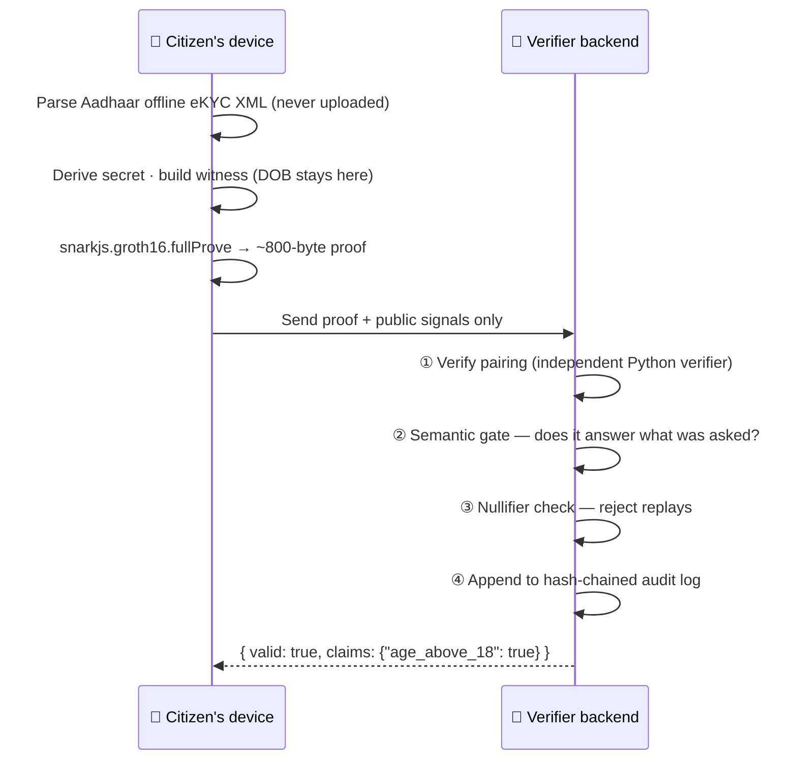

<div align="center">

# 🕉️ ZKGate India

### India's first indigenous Zero-Knowledge Identity Layer

**Prove a fact about yourself. Not your identity.**

[](#licence)
[](https://techgig.com/hackathon/SovereignTechnologyforIndia)
[](docs/ARCHITECTURE.md)
[](circuits/test)
[](backend/tests)
[](sdk/test)

[🌐 Landing page](index.html) · [🏗 Architecture](docs/ARCHITECTURE.md) · [📜 Claims Catalogue](docs/CLAIMS.md) · [⚖️ The Honest Caveat](#-the-one-honest-caveat)

</div>

<br>

> Today, proving you're an adult to buy a SIM means handing over a photocopy that
> also reveals your name, exact date of birth, address, photo, and a permanent
> national identifier — to a counterparty who now has to store and secure all of
> it, and often doesn't.

ZKGate replaces the photocopy with a **zero-knowledge proof**. Your Aadhaar
offline eKYC XML is parsed **in your own browser**. A proof is generated **on
your device** that answers exactly one question — *"age ≥ 18?"* — and nothing
else. The verifier checks the proof's mathematics and learns only the answer.

No name. No date of birth. No address. No Aadhaar number ever leaves your
device. Only a **~800-byte cryptographic proof** does.

---

## 📋 Contents

- [Why this exists](#-why-this-exists)
- [How it works](#-how-it-works)
- [What's in the box](#-whats-in-the-box)
- [Quick start](#-quick-start)
- [Two design decisions worth knowing](#-two-design-decisions-worth-knowing)
- [The one honest caveat](#-the-one-honest-caveat)
- [Where this stands vs. the field](#-where-this-stands-vs-the-field)
- [Documentation](#-documentation)

---

## 🇮🇳 Why this exists

| | |
|---|---|
| **₹22,495 Cr** | lost to cyber fraud in India in 2025 — much of it "digital arrest" scams built on citizens believing sharing Aadhaar/PAN is a normal verification step |
| **7.9M+** | KYC records leaked from a single compromised fintech vendor in Jan 2025 — the cost of every verifier holding its own copy of your documents |
| **13 May 2027** | the DPDP Act deadline by which every gaming, social, and e-commerce platform in India must verify age/consent *without* creating a new data liability |

ZKGate is built so none of the above has to keep happening the same way.

---

## ⚙️ How it works



The XML never leaves the browser. There is no upload endpoint on the server
that would even accept it.

---

## 📦 What's in the box

| Directory | What it is | Status |
| --- | --- | --- |
| [`circuits/`](circuits/) | 5 Circom circuits (age, location, citizenship, compound KYC, PAN) + Groth16 setup | ✅ All five closed the `signature_valid` stub via a real in-circuit EdDSA issuer-credential check (see caveat below). All five re-keyed against a fresh Powers-of-Tau. **34/34** tests pass. |
| [`backend/`](backend/) | FastAPI verification API — Python Groth16 verifier, nullifier replay-guard, tamper-evident audit chain | ✅ `trust_level` uniformly issuer-registry-driven across all five claims. **30/30** pytest pass, including the replay-guard. |
| [`sdk/`](sdk/) | JavaScript SDK — parse Aadhaar XML, derive secret, build witness, generate & submit proofs | ✅ Rewritten for the issuer-credential model. **9/9** tests pass. |
| [`frontend/`](frontend/) | Next.js citizen portal — in-browser proof generation | ✅ Builds clean |
| [`verifier-portal/`](verifier-portal/) | Next.js verifier portal — request & verify proofs | ✅ Builds clean |
| [`test-data/`](test-data/) | Synthetic Aadhaar XMLs and fixtures (no real identities) | — |
| [`docs/`](docs/) | Architecture, claims catalogue, the UIDAI integration gap, trusted-setup notes | — |

Every layer verifies **real cryptography**, not a mock. The backend's Python
verifier is cross-checked against snarkjs, and the JS and Python geography
encoders are proven byte-identical so a proof built in the browser verifies on
the server.

---

## 🚀 Quick start

Prerequisites: **Node ≥ 20**, **Python ≥ 3.11**, **circom 2.x**, and (optional)
Docker. `snarkjs` is installed as a dependency.

```bash
# 1. Install JS deps (root workspace) and Python deps
npm install
python -m venv .venv
.venv/Scripts/pip install -r backend/requirements.txt   # Windows
# .venv/bin/pip install -r backend/requirements.txt      # macOS/Linux

# 2. Build the circuits (compile + trusted setup + copy artifacts to the portal)
npm run build:circuits

# 3. Run everything
npm run dev            # frontend :3000, verifier :3001, backend :8000
```

Then open **http://localhost:3000**, click *Load test citizen*, pick a claim,
and generate a proof. Send it to the demo bank and watch it verify — then send
it again and watch the replay get rejected.

<details>
<summary><strong>▶ See the whole pipeline in one command</strong></summary>

<br>

With the backend running (`npm run dev:backend`):

```bash
node scripts/e2e_demo.mjs
```

```
✓ Proof generated in 390ms (8 public signals)
  Public signals contain no DOB: ✓ confirmed
✓ VALID. Claims: {"age_above_18":true,"age_threshold_proven":18}
✓ Replay refused: "proof already used (replay); request a fresh proof"
✓ Semantic gate refused it: "proof establishes age>=18, claim needs age>=21"
✓ End-to-end pipeline behaves correctly.
```

</details>

<details>
<summary><strong>▶ Run the tests</strong></summary>

<br>

```bash
bash scripts/run_tests.sh        # circuits + SDK + backend
```

</details>

---

## 💡 Two design decisions worth knowing

**1. Circuits _constrain_ their claims — they don't _report_ them.**
The naive age circuit outputs `is_valid = 0` for a minor and lets the verifier
check the flag. That's a footgun: any verifier who forgets the check is wide
open, and an underage person still holds a "valid" proof. Here the circuit
asserts `is_valid === 1`, so a minor **cannot generate a proof at all**. "The
proof verifies" and "the claim is true" become the same statement. (See the
header comment in [`circuits/src/ageProof.circom`](circuits/src/ageProof.circom).)

**2. Verification is two gates.**
A cryptographically valid proof can still answer the wrong question — an
`age ≥ 18` proof does not establish `age ≥ 21`. The backend verifies the
pairing **and** checks the public signals match what the verifier asked, then
rejects mismatches. Both gates are tested.

---

## ⚠️ The one honest caveat

> [!IMPORTANT]
> This prototype proves the **zero-knowledge layer** end to end with real
> cryptography. The original gap was the **signature attestation**: every
> circuit's client asserted `signature_valid = 1` rather than proving anything
> about where the data came from.

**All five circuits have now closed that stub.** Every one of them verifies,
in-circuit, a real EdDSA-Poseidon signature from a named issuer key over a
Poseidon commitment to the exact attributes that circuit's claim depends on —
see [`circuits/src/helpers/issuerCredential.circom`](circuits/src/helpers/issuerCredential.circom),
the reference issuer in [`scripts/issuer/issue_credential.mjs`](scripts/issuer/issue_credential.mjs),
and the registry in [`backend/services/issuer_registry.py`](backend/services/issuer_registry.py).
A citizen can no longer self-assert a fabricated date of birth, address, or PAN
linkage; they must hold a genuine signature, from a registered issuer key, over
the exact attributes being proved — tamper with one digit after the fact and
the signature check fails (see the tampered-value tests in `circuits/test/`).

> [!WARNING]
> **Precision matters here: these are issuer-verified proofs, not UIDAI-verified
> proofs.** The circuits check that a registered enrolment issuer (an AUA/KUA —
> a bank, telco, or Common Service Centre already authorised by UIDAI to
> perform Aadhaar e-KYC) genuinely signed the attributes; they do **not**
> verify UIDAI's own RSA-SHA256 signature in-circuit. That is a real,
> checkable gap, not a rounding error, and describing this system as
> "UIDAI-verified" would overclaim what it does.

See [`docs/UIDAI_INTEGRATION.md`](docs/UIDAI_INTEGRATION.md) for the full
model and [`docs/XML_SIGNATURE_SPIKE.md`](docs/XML_SIGNATURE_SPIKE.md) for an
evidence-based estimate of what closing that further gap — in-circuit UIDAI
verification over the offline eKYC XML — would actually cost.

The trusted setup here is a single-party ceremony, fine for a prototype and
not for production; see [`docs/TRUSTED_SETUP.md`](docs/TRUSTED_SETUP.md) and
the concrete multi-party plan in
[`docs/TRUSTED_SETUP_CEREMONY_PLAN.md`](docs/TRUSTED_SETUP_CEREMONY_PLAN.md).

---

## 🥊 Where this stands vs. the field

Most "privacy-preserving" Aadhaar tools today share *fewer fields* — but still
reveal the *real value* of whatever's shared. True zero-knowledge reveals only
the boolean answer, never the value underneath. That distinction is the actual
gap this project targets.

| System | Live today? | True ZK or selective disclosure? |
| --- | --- | --- |
| UIDAI New Aadhaar App | ✅ Yes — 40M+ downloads | 🔶 Selective disclosure (reveals real value) |
| Google Wallet Aadhaar VC | ✅ Yes | 🔶 Selective disclosure (ISO 18013-5 mdoc) |
| Anon Aadhaar (Ethereum Foundation) | ⏳ Pre-production | ✅ True ZK (QR-based) |
| Self Protocol (self.xyz) | ✅ Yes, funded | ✅ True ZK |
| **ZKGate India** | 🧪 Prototype | ✅ **True ZK — offline eKYC XML channel** |

Full, sourced comparison: [`docs/COMPARISON_ANON_AADHAAR.md`](docs/COMPARISON_ANON_AADHAAR.md).

---

## 📚 Documentation

| Doc | What's in it |
| --- | --- |
| [`docs/ARCHITECTURE.md`](docs/ARCHITECTURE.md) | How the pieces fit, data flow, threat model |
| [`docs/CLAIMS.md`](docs/CLAIMS.md) | Every claim, what it reveals, what it hides |
| [`docs/UIDAI_INTEGRATION.md`](docs/UIDAI_INTEGRATION.md) | The issuer-vs-UIDAI signature gap and how to close it |
| [`docs/TRUSTED_SETUP.md`](docs/TRUSTED_SETUP.md) | The ceremony and its security |
| [`docs/TRUSTED_SETUP_CEREMONY_PLAN.md`](docs/TRUSTED_SETUP_CEREMONY_PLAN.md) | The concrete multi-party ceremony plan |
| [`docs/XML_SIGNATURE_SPIKE.md`](docs/XML_SIGNATURE_SPIKE.md) | In-circuit UIDAI XML verification: what it would cost |
| [`docs/PROVING_SYSTEM_EVALUATION.md`](docs/PROVING_SYSTEM_EVALUATION.md) | Circom/Groth16 vs. Halo2/Noir, and why |
| [`docs/COMPARISON_ANON_AADHAAR.md`](docs/COMPARISON_ANON_AADHAAR.md) | Where this project stands against Anon Aadhaar, honestly |
| API reference | Run the backend and open **http://localhost:8000/docs** |

---

<div align="center">

## 📄 Licence

MIT (prototype).

**Sovereign by design** — no dependency on a foreign wallet, no server that
ever sees your Aadhaar XML.

</div>
